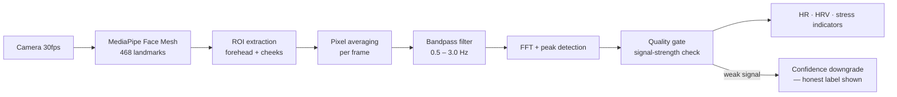

# Face Scanner

**Camera-based biomarker analyzer** — estimates **heart rate, HRV and stress indicators** from an ordinary webcam via **remote photoplethysmography (rPPG)**. 100% client-side: no backend, no uploads, no analytics — every video frame stays in your browser.

<p align="center"><i>webcam → face landmarks → skin-signal extraction → bandpass filter → FFT → BPM + HRV + confidence score</i></p>

## Why this repo exists

rPPG (remote photoplethysmography) is usually locked inside research papers or medical-device marketing. This is the whole pipeline — signal extraction, filtering, spectral analysis, quality gating — as a **readable, dependency-light web app** you can run, audit and modify:

- **2,700+ line analyzer engine** — every stage commented, no minified black boxes
- **Honest confidence gating** — the UI tells you when it *doesn't* trust a reading (most apps never do)
- **Full methodology write-up** — filter choices, FFT windowing and known limits documented, not hand-waved

## How it works



1. **Face landmarks** — MediaPipe Face Mesh locks 468 points onto the face; forehead and cheek regions become measurement ROIs.
2. **Signal extraction** — per-frame ROI pixel averaging picks up the microscopic colour shifts caused by blood-volume pulses (~1% amplitude, invisible to the eye).
3. **Conditioning** — detrending + bandpass filtering to the physiological heart-rate band (0.5–3.0 Hz).
4. **Spectral analysis** — FFT with peak detection (plus inter-beat-interval peak verification, 0.5 s min distance) converts the signal to BPM; RMSSD-style interval analysis derives HRV.
5. **Quality gate** — signal-strength scoring drives a live confidence label. Poor lighting/motion → the app says so instead of inventing a number.

**Accuracy:** the ±2–3 BPM / ±5–10 ms RMSSD figures are literature values for rPPG pipelines of this type — *not* independently certified measurements of this implementation. The app's own honesty mechanism is the confidence gate: it labels every reading (roughly 85%+ / 70–85% / <50% trust tiers) and downgrades itself when the signal is weak. Full tier table and methodology: [`accuracy.html`](accuracy.html) · [`HEART_RATE_HRV_METHODOLOGY.md`](HEART_RATE_HRV_METHODOLOGY.md).

## Run it

Static site — no build step, no dependencies:

```bash
python3 -m http.server 8080
# open http://localhost:8080/analyzer-full.html
```

Allow camera access when prompted. A mobile-friendly variant is included (`mobile-analyzer.html`).

## What's in the box

| File | Purpose |
|---|---|
| `analyzer-full.html` / `analyzer-full.js` | Desktop analyzer — full pipeline UI (2,700+ line engine) |
| `mobile-analyzer.html` / `mobile-analyzer.js` | Phone-camera variant |
| `methodology.html` + `HEART_RATE_HRV_METHODOLOGY.md` | Signal-processing deep-dive: ROIs, filters, FFT, limits |
| `biomarker-guide.html` | What each metric (HR, RMSSD, stress) actually means |
| `accuracy.html` | Confidence tiers and honest conditions table |
| `export.html` | Session data export |
| `OPEN_SOURCE_LICENSES.md` | Third-party notices (MediaPipe Face Mesh, FFT) |
| `MODELS.md` | **Model inventory** — every model this analyzer uses (CDN-loaded) + the full Volkus demographic-scan model set (age/gender/liveness/ethnicity ONNX, hashes, lineage) and why the binaries aren't on GitHub |

## Privacy

- All processing is **on-device** — the camera stream never leaves the browser tab
- No analytics, no accounts, no network calls after page load
- Exports are generated locally; you choose where they go

## Not a medical device

Wellness estimates only. rPPG is genuinely neat physics, but it degrades with poor lighting, motion, compression, and some skin tones less represented in training data — which is exactly why the confidence gate exists. Read [`accuracy.html`](accuracy.html) before drawing conclusions from a reading.

## License

MIT — see [LICENSE](LICENSE). Third-party component licenses in [OPEN_SOURCE_LICENSES.md](OPEN_SOURCE_LICENSES.md).
